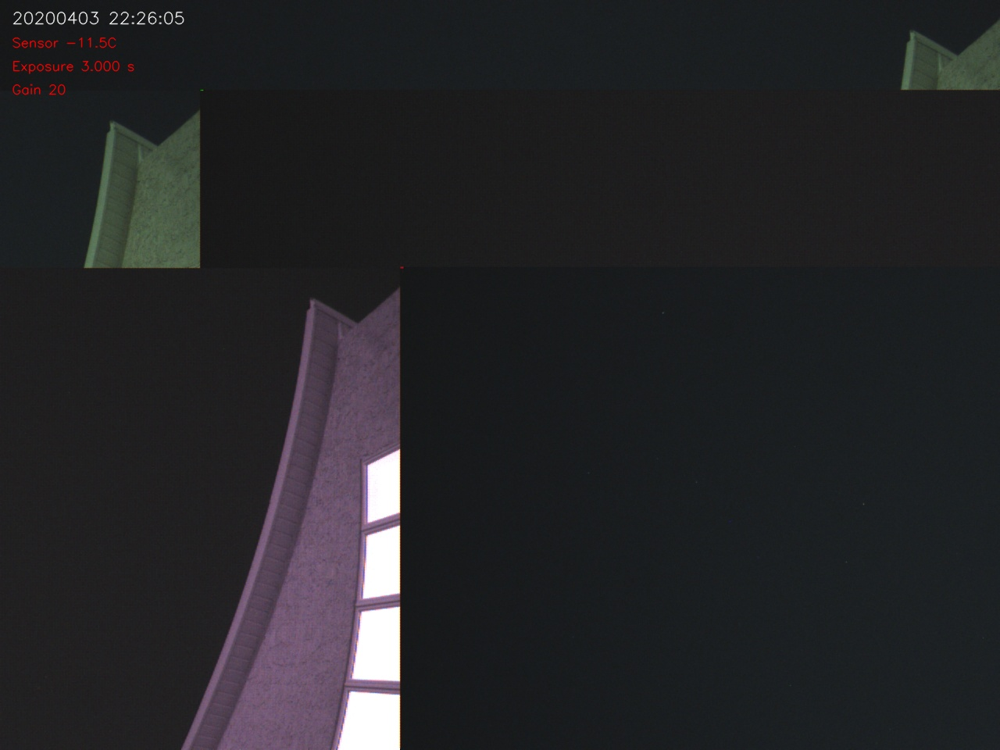

# ASI120MC Mosaic Images Bug

## Background

This is related to [Issue 96](https://github.com/thomasjacquin/allsky/issues/96) and possibly be related to [Issue 167](https://github.com/thomasjacquin/allsky/issues/167). In short, it seems with some configurations when using an ASI120MC camera occasionally the resulting image will appear to look like a mosaic of multiple images.

Here is a sample

### All Samples
- [Sample 1](sample-1.jpg)
- [Sample 2](sample-2.jpg)
- [Sample 3](sample-3.jpg)

## A Proposed Solution

The proposed solution is to add a function to capture.cpp within the main while loop of the main function to inspect the generated image from the camera for any horizontal lines. As such this solution assumes that there is no building structure in the shot that will generate a horizontal line. If it finds any horizontal lines it will then have the loop go back and fetch another image from the camera.

In practise these "mosaic" images clear up during the next read from the camera (though sometimes it may take several reads).

### Steps

1. Take the image from the camera and apply a Sobel Edge detection transform to bring out the hard edges
2. Then apply a Hough Line Probabilistic transform to look for horizontal lines
3. If the line count is greater than 0 we will fetch another image, otherwise, process as normal

## Equipment Used

- __Hardware:__ Raspberry Pi 2 Model B Rev 1.1
- __OS:__ Raspbian GNU/Linux 10 (buster)
- __Camera:__ Acouto T7C (an ASI120MC Clone)

## Contributions

- Thomas Jacquin (for maintaining this project)
- Harold Liang (for his broken image detector)
- OpenCV Documentation/Demos for
  - Sobel
  - Hough Line Probabilistic
- Andrey Kamaev (Stack Overflow Post)

## Websites used

- [Highlight edges in Images with Sobel](https://docs.opencv.org/2.4/doc/tutorials/imgproc/imgtrans/sobel_derivatives/sobel_derivatives.html)
- [Detect lines using OpenCV](https://www.codepool.biz/opencv-line-detection.html)
- [Detect only Horizontal & Vertical Lines](https://stackoverflow.com/a/7228823)
